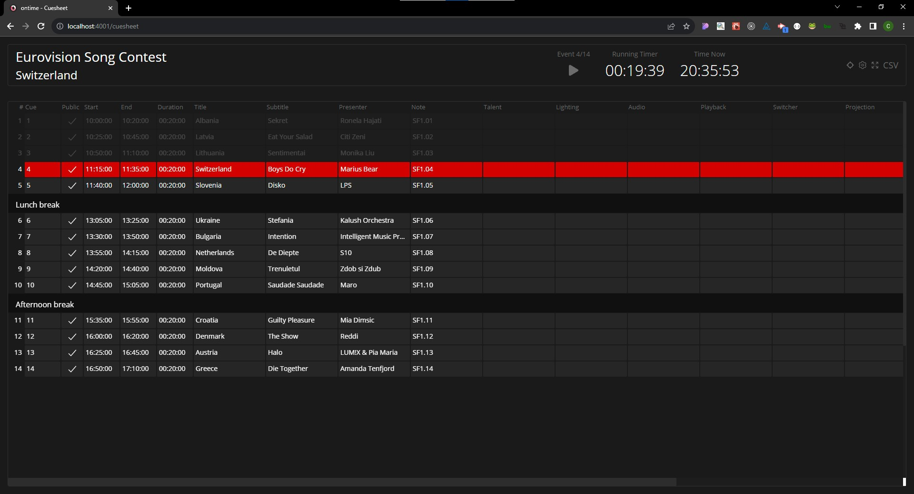

# ontime


This information relates to version 2 of the app.

You likely should be using the newest version of the app, and the [new docs](https://docs.getontime.no/)

Alternatively you might be looking for the [v1 documentation](https://ontime.gitbook.io/v1/)

Looking for [the website](https://app.gitbook.com/s/Sb0ytUDJ43WC0zQPSW8Y/main-concepts/interface-1/info)?

Looking for downloads?

* [MacOS](https://github.com/cpvalente/ontime/releases/latest/download/ontime-macOS.dmg)
* [Windows](https://github.com/cpvalente/ontime/releases/latest/download/ontime-win64.exe)
* [Linux](https://github.com/cpvalente/ontime/releases/latest/download/ontime-linux.AppImage)
* [Docker ](https://hub.docker.com/r/getontime/ontime)(see [docs here](additional-notes/use-in-raspberry-pi.md))


Ontime is an application for creating and managing event rundowns and timers.

It helps to organise and schedule a list of events and their information. The information is then distributed over the network and presented in different views.

Any device in the network with a browser can be a consumer of the views, making for an efficient way to distribute over a venue using a network infrastructure instead of video outputs.

<figure><figcaption>
Cuesheet
</figcaption></figure>

.png>)

The app is available for [MacOS](https://github.com/cpvalente/ontime/releases/latest/download/ontime-macOS.dmg), [Windows](https://github.com/cpvalente/ontime/releases/latest/download/ontime-win64.exe), [Linux ](https://github.com/cpvalente/ontime/releases/latest/download/ontime-linux.AppImage)and [docker images](https://hub.docker.com/r/getontime/ontime).

### Unopinionated

We want Ontime to be unique by targeting freelancers instead of roles. We believe most freelancers work in different fields and we want to give you a tool that you can leverage across your many environments and workflows

We are not interested in forcing workflows and have made Ontime so, it is flexible to whichever way you would like to work.
