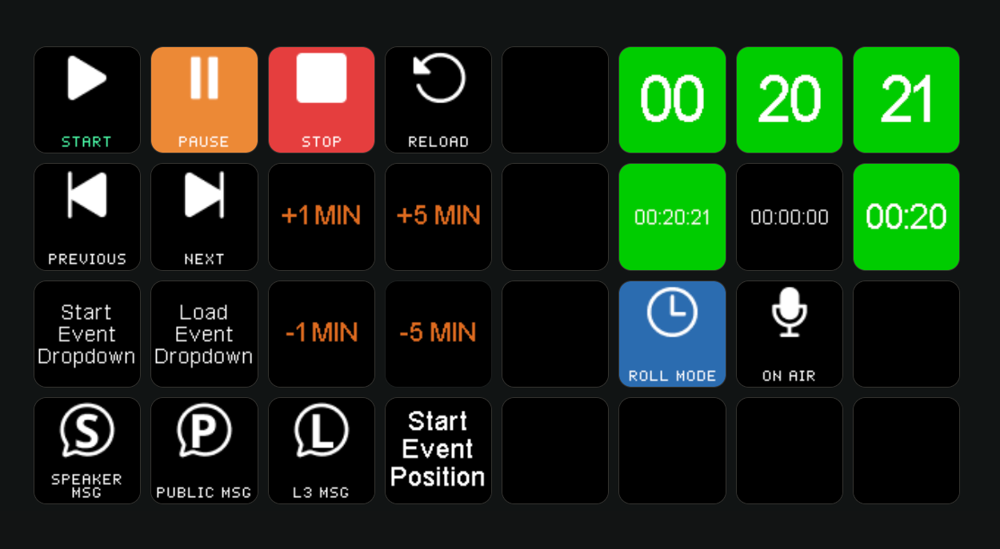

# Companion module

We have a great companion module. Check it out!

In case you would like to ask for an extension or report a bug, please use [the module repository](https://github.com/bitfocus/companion-module-getontime-ontime)

<figure><figcaption>
Companion setup with actions and feedback
</figcaption></figure>
