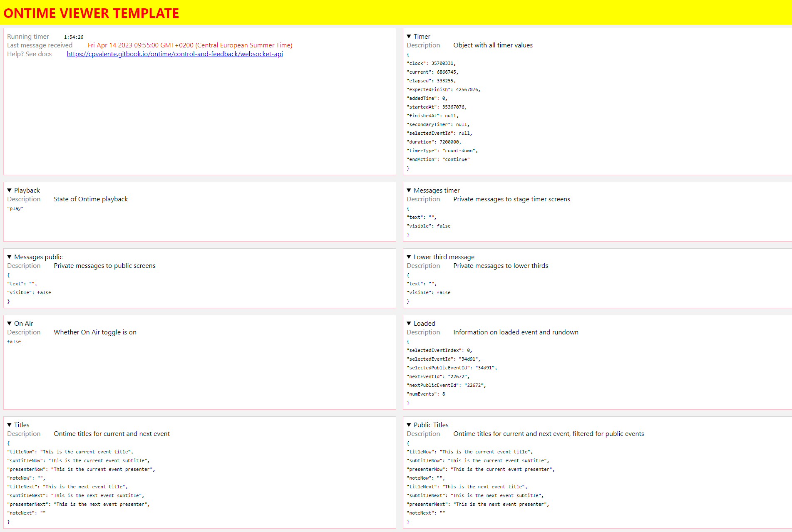

# Make your own viewer

Ontime broadcasts its payload over websockets and it is available to any device in the local network.&#x20;

With some basic skills in HTML + CSS + Javascript (or any language that can run in the browser) you are able to create your own viewers for ontime data. To get started, see [this javascript template in GitHub ](https://github.com/cpvalente/ontime-viewer-template-v2)and consult the [websocket API ](../control-and-feedback/ontime-apis/#osc-and-websocket-api)for any further clarifications.

This will enable you to create your own styles to match corporate or event identity. You can also use this to create any screen types unavailable with the app.

