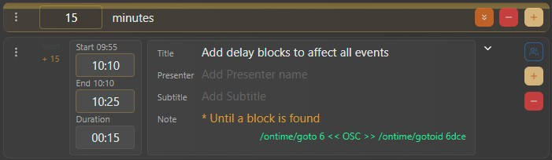

# The delay workflow

The delay workflow is thought of a way to control schedule delays in realtime. Few notes:

The delay information is added as an overlay to warn backstage users that the event rundown schedule has changed without affecting any of the publicly available screens.


Delays only show in backstage screens, no delay information is show in the public screens


Looking at the image above, we see that a delay event with a value of 15 minutes causes events 6 and 7 to have a delay. The delay is stopped by a block event and event 8 runs as normal.

As shown in the image above, event 6 has been delayed by 15 minutes. This is visible with the _+15_ indication on the left.&#x20;

The timer also has two indications now, _09:55_ and _10:10_ (for the start time): meaning the original time of 09:55 has been delayed and is now 10:10. The delayed times have a light orange outline

Using _Apply Delays_ function (orange button with double chevrons down), we can apply the change in times permantely
